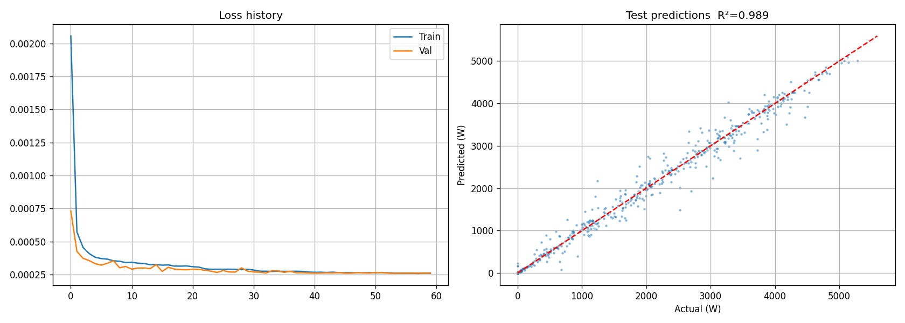
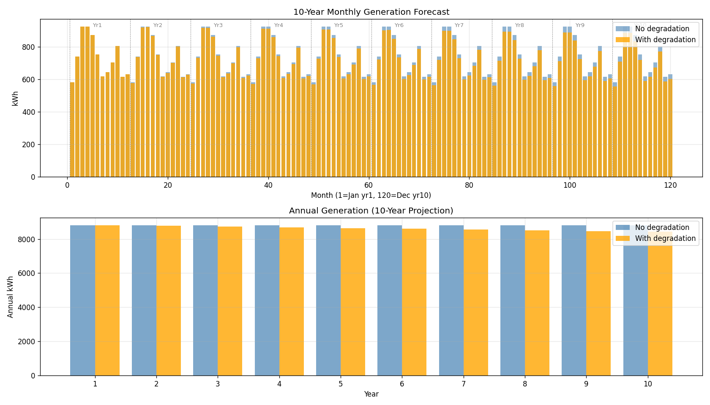
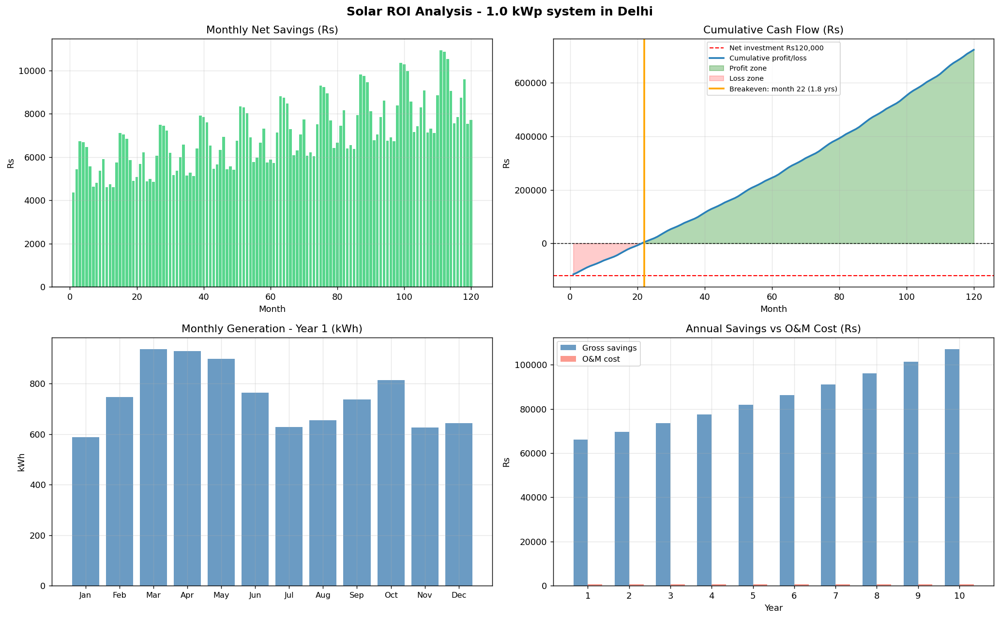

<div align="center">

# Solar ROI Predictor

[](https://python.org)
[](https://pytorch.org)
[](https://pvlib-python.readthedocs.io)
[](https://flask.palletsprojects.com)
[]()
[](LICENSE)

A solar investment calculator for the Indian residential market combining physics simulation with machine learning.

> With a 6 kWp system in Delhi at Rs 2,70,000 installed cost,
> break even is 2 years 5 months.
> 10-year net profit: Rs 7,06,011. Annual IRR: 54.6%.
>
> Actual output from this pipeline, New Delhi, verified June 2025

</div>

## Contents

[The Problem](#the-problem) | [How It Works](#how-it-works) | [Pipeline](#pipeline-architecture) | [Results](#results) | [Tech Stack](#tech-stack) | [Getting Started](#getting-started) | [API](#api-reference) | [Financial Assumptions](#financial-model) | [Limitations](#known-limitations) | [Project Structure](#project-structure)

## The Problem

Solar installers in India will tell you its a long term investment and you will see returns in X years. That X is usually a guess. Heres why:

**Shading.** A shadow from a water tank or a neighbouring building can cut panel output by 30-50% during peak hours. Most calculators assume a perfectly clear rooftop.

**Weather patterns.** Delhi in January generates about 40% less solar energy than Delhi in June. Annual averages hide the months where your panels barely cover your own consumption, and that directly determines how fast your investment pays back.

**Tariff escalation.** Indian DISCOMs have raised electricity rates by 5-7% every year for the past decade. A calculator that freezes todays rate for 10 years underestimates your lifetime savings by lakhs of rupees.

**Panel degradation.** Solar panels lose about 0.5% of peak efficiency per year. After 10 years your system produces 5% less than day one. Most brochures dont mention this.

**Government subsidies.** The PM Surya Ghar Muft Bijli Yojana (2024) offers Rs 30,000 to Rs 1,05,000 depending on system size. Generic tools dont account for this.

The result is that homeowners either buy a system that doesnt make financial sense, or they pass on a genuinely profitable investment because the numbers were too vague.

This project gives you the real number derived from your actual location, not a national average.

## How It Works

A 7-stage pipeline takes GPS coordinates and household details and produces a month-by-month financial projection.

```
Coordinates + roof area + monthly bill + budget
                    |
     [ physics simulation + ML forecasting ]
                    |
   "Break even: 2 years 5 months. 10-yr profit: Rs 7,06,011"
```

1. Fetch real weather - 5+ years of hourly satellite data from NASA POWER for your exact GPS location.
2. Simulate your panels - pvlib physics engine models your specific panel type, inverter, roof tilt, and orientation.
3. Apply shading - sun position calculated every hour, checked against your local horizon profile. Shaded hours are zeroed out.
4. Train a neural network - PyTorch LSTM learns weather-to-power relationships from 8,700+ hours of data.
5. Forecast 10 years - model predicts monthly generation for 120 months, with degradation applied year by year.
6. Build the financial model - kWh converted to rupees using your DISCOM tariff, escalated 6% per year, with subsidies and O&M deducted.
7. Find the exact crossover - cumulative savings scanned month by month until it crosses your net investment cost.

## Pipeline Architecture

```
                    USER INPUTS
    GPS coords . Roof area . Monthly bill . City . Budget
                            |
            ---------------------------------
            |                               |
    STAGE 1: Weather Fetch        STAGE 2: Shadow Analysis
    NASA POWER API                pvlib sun position
    5+ yrs, hourly                Local horizon profile
    GHI, DNI, DHI, Temp           -> shading_factor/hr
            |                               |
            --------------------------------
                            |
            STAGE 2: PV Physics Simulation
            pvlib ModelChain, panel + inverter model, roof geometry
            Weather -> AC power (W/hr), shading factor applied
                            |
            STAGE 3: LSTM Training
            PyTorch, 128 hidden, 2 layers, HuberLoss, AdamW
            9 features including cyclical time encoding
            Test R2 = 0.9839, RMSE = 181 W, MAE = 101 W
                            |
            STAGE 4: 10-Year Generation Forecast
            LSTM -> monthly kWh, 0.5%/yr degradation curve
            Output: 120 months of predicted generation
                            |
            STAGE 5: India Financial Model
            13-city DISCOM tariffs, 6%/yr escalation
            PM Surya Ghar subsidy (auto), net metering, O&M
                            |
            STAGE 6: ROI Engine
            Month-by-month crossing point scan
            -> Payback (years + months), 10-yr profit, IRR
                            |
            STAGE 7: REST API (Flask)
            POST /roi-report -> full financial analysis JSON
            POST /predict -> next-hour AC power (W)
            GET /tariffs -> DISCOM rates + subsidy slabs
```

## Results

All results from running the complete pipeline on New Delhi (28.61N, 77.20E).
Test suite: 34 tests, 34 passed.

### LSTM Model - Training Performance

| Metric | Value |
|--------|-------|
| R2 (test set) | 0.9839 |
| RMSE | 181.3 W |
| MAE | 101.0 W |
| Split method | Chronological (no data leakage) |
| Training time | ~30 epochs, early stop |



### 10-Year Generation Forecast - New Delhi, 6 kWp

| Year | Annual kWh (with degradation) |
|------|-------------------------------|
| Year 1 | 9,093 kWh |
| Year 3 | 9,002 kWh |
| Year 5 | 8,913 kWh |
| Year 10 | 8,692 kWh |
| 10-yr total | 88,913 kWh |



### ROI Analysis - 6 kWp, Delhi, Rs 2,70,000 Installed

| Parameter | Value |
|-----------|-------|
| PM Surya Ghar subsidy | Rs 1,05,000 |
| Net investment after subsidy | Rs 1,65,000 |
| Base DISCOM tariff (Delhi) | Rs 8.50/kWh |
| Tariff escalation | 6%/year |
| Payback period | 2 years 5 months |
| 10-year net profit | Rs 7,06,011 |
| Annual IRR | 54.6% |
| CO2 offset over 10 years | 72.9 tonnes |



## Tech Stack

| Layer | Tool |
|-------|------|
| Weather data | NASA POWER API |
| PV physics | pvlib-python |
| Deep learning | PyTorch LSTM |
| Preprocessing | scikit-learn + joblib |
| API | Flask |
| Data | pandas + numpy |
| Timezone | timezonefinder |
| Visualisation | matplotlib |

## Getting Started

Prerequisites: Python 3.8+

```bash
git clone https://github.com/PranjalSingh25/Solar-Power-Forecasting-Prediction
cd Solar-Power-Forecasting-Prediction

python -m venv venv
source venv/bin/activate

pip install -r requirements.txt
```

## Running the Pipeline

Run stages in order. Each stage writes a file that the next stage reads.

### Stage 1 - Fetch Weather

```bash
python stage1_fetch_weather.py
```
Prompts for latitude, longitude, start year, end year. Output: `data/nasa_power_hourly_raw.csv`

### Stage 2 - PV Simulation + Shadow Analysis

Edit the config at the top of `stage2_simulate_pv.py`:

```python
LATITUDE           = 28.6139
LONGITUDE          = 77.2090
SURFACE_TILT       = 28
SURFACE_AZIMUTH    = 180
MODULES_PER_STRING = 10
STRINGS_PER_INV    = 2
HORIZON_ELEVATIONS = [5.0] * 36
```

```bash
python stage2_simulate_pv.py
```
Output: `data/processed/weather_and_simulated_hourly_power.csv`

### Stage 3 - Train the LSTM

```bash
python stage3_train_lstm.py

# With custom hyperparameters:
python stage3_train_lstm.py --epochs 100 --seq_len 48 --hidden 256 --lr 0.0005
```

| Flag | Default | Description |
|------|---------|-------------|
| `--epochs` | 60 | Max training epochs |
| `--seq_len` | 24 | Input window (hours) |
| `--hidden` | 128 | LSTM hidden units |
| `--layers` | 2 | LSTM stacked layers |
| `--lr` | 0.001 | Learning rate |
| `--patience` | 12 | Early stopping patience |

Output:
```
models/best_lstm_model_hourly.pth
models/feature_scaler_hourly.joblib
models/target_scaler_hourly.joblib
plots/training_results.png
```

### Stage 4 - 10-Year Forecast

```bash
python stage4_forecast_10yr.py
```
Output: `data/processed/monthly_forecast_10yr.csv`, `plots/forecast_10yr.png`

### Stage 5+6 - Financial Model & ROI

```bash
python stage56_financial_roi.py
```
Output: `data/processed/roi_analysis.csv`, `plots/roi_analysis.png`

### Stage 7 - Start the API

```bash
python app.py
# Running at http://127.0.0.1:5001
```

## API Reference

### GET /health

```json
{ "status": "ok", "model": true, "forecast_ready": true, "device": "cpu" }
```

### GET /tariffs

Returns all 13 supported cities with DISCOM tariffs and PM Surya Ghar subsidy slabs.

### POST /predict

Next-hour AC power from 24 hours of weather data.

```bash
curl -X POST http://127.0.0.1:5001/predict \
  -H "Content-Type: application/json" \
  -d '{"data": [ ... 24 hourly weather dicts ... ]}'
```

```json
{ "predicted_power_W": 1847.32, "predicted_power_kW": 1.8473, "unit": "Watts" }
```

### POST /roi-report

Full 10-year financial analysis.

```bash
curl -X POST http://127.0.0.1:5001/roi-report \
  -H "Content-Type: application/json" \
  -d '{
    "system_kwp":         6.0,
    "install_cost_rs":    270000,
    "monthly_usage_kwh":  450,
    "city":               "delhi",
    "net_metering_pct":   0.80,
    "tariff_escalation":  0.06
  }'
```

```json
{
  "input":   { "system_kwp": 6.0, "city": "delhi", "base_tariff": 8.5 },
  "subsidy": { "pm_surya_ghar_rs": 105000, "net_investment_rs": 165000 },
  "result":  {
    "payback_readable":   "2 years 5 months",
    "net_profit_10yr_rs": 706011,
    "irr_annual_pct":     54.56,
    "total_10yr_kwh":     88913,
    "co2_saved_tonnes":   72.91
  },
  "monthly_cashflow": [ ... 120 rows ... ]
}
```

Supported cities: `delhi`, `mumbai`, `bangalore`, `hyderabad`, `chennai`, `kolkata`, `pune`, `ahmedabad`, `jaipur`, `lucknow`, `chandigarh`, `bhopal`, `generic`

## Financial Model

| Parameter | Default | Source |
|-----------|---------|--------|
| Panel degradation | 0.5%/year | IEC 61215 |
| Tariff escalation | 6%/year | Historical DISCOM average 2015-2024 |
| System cost | Rs 45,000/kWp | 2024 Indian residential market |
| O&M cost | Rs 750/kWp/year | Conservative estimate |
| Net metering credit | 80% of retail tariff | Average across DISCOMs |
| Subsidy <=1 kWp | Rs 30,000 | MNRE Feb 2024 |
| Subsidy <=2 kWp | Rs 60,000 | MNRE Feb 2024 |
| Subsidy <=3 kWp | Rs 78,000 | MNRE Feb 2024 |
| Subsidy 3-10 kWp | Rs 78,000 + Rs 9,000/kWp | MNRE Feb 2024 |
| CO2 factor | 0.82 kg/kWh | CEA India 2023 |

## Known Limitations

**Trained on simulated data.** R2 = 0.9839 measures replication of pvlibs physics model, not a real solar meter. Real-world factors (dust soiling, partial shading, inverter faults) are not modelled. Actual generation may be 5-15% below projections.

**One year of training data.** The current model was trained on 2016 weather for New Delhi. Training on 5+ years would improve monsoon season accuracy.

**Approximate horizon shading.** Uses a uniform 5 degree obstruction angle. Real urban horizons are irregular. Precise profiles require a site survey or LiDAR data.

**India-specific financial model.** The physics pipeline works globally. The financial model (tariffs, subsidies, net metering) is built for India and would need adaptation for other markets.

## Project Structure

```
Solar-Power-Forecasting-Prediction/
|
+-- stage1_fetch_weather.py
+-- stage2_simulate_pv.py
+-- stage3_train_lstm.py
+-- stage4_forecast_10yr.py
+-- stage56_financial_roi.py
+-- app.py
+-- tests/
|   +-- test_pipeline.py
+-- plots/
|   +-- training_results.png
|   +-- forecast_10yr.png
|   +-- roi_analysis.png
+-- data/
+-- models/
+-- logs/
+-- config/
```

## Contributing

Contributions welcome. Highest impact areas:

- Real generation data from smart inverters or DISCOM records
- More city tariffs for Tier-2 cities and rural feeders
- Shading precision through Open-Meteo horizon data or Google Solar API

Open an issue before starting significant work.

## License

MIT License - see [LICENSE](LICENSE) for details.

## Author

**Pranjal Singh**

[](https://www.linkedin.com/in/pranjal-singh-265937286/)
[](https://github.com/PranjalSingh25)

<div align="center">

*Is solar actually worth it for me, and exactly when will I get my money back?*

</div>
